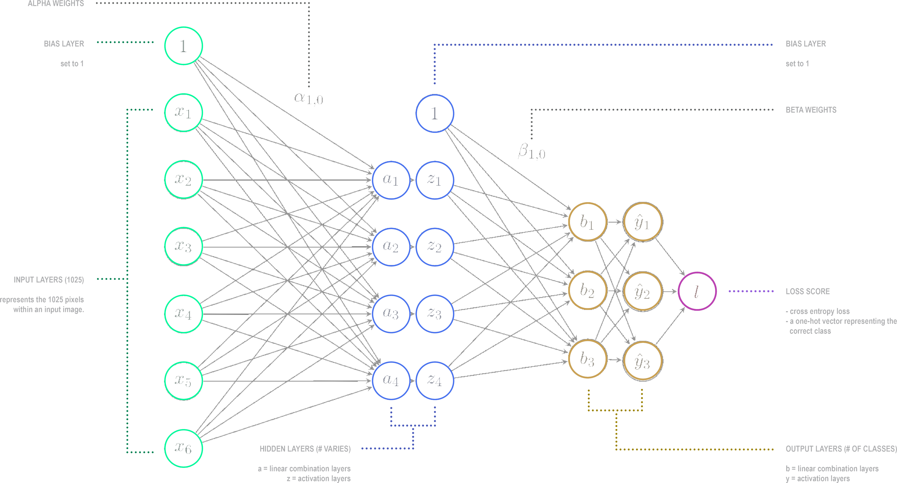
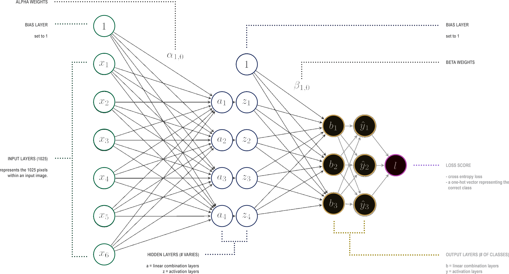

# Image Classification Neural Network from Scratch

<br>


<br>

## About 

A custom, from-scratch implementation of an image classification neural network using Adagrad, a variant of stochastic gradient descent, a sigmoid activation function hidden layer, and a softmax output layer

## Project Page

An expanded description of this model implimentation can be found on its project page here:

<br>

```
www.michaelhasey.com/neural-network-from-scratch
```

## Table of Contents

<br>

- [Background](#Background)
- [Dataset](#Dataset)
- [Model-Architecture](#Model-Architecture)
- [Implementation-Details](#Implementation-Details)
- [Command-Line-Arguments](#Command-Line-Arguments)
- [Performance](#Performance)
- [References](#References)
- [Citation](#Citation)

<br>

## Background

<br>

The neural network shown below is representation of the image classification neural network built from scratch for this project.  It is made up of three layers; an input layer, a hidden layer, and an output layer.  Within each layer are a combination of neurons, each representing a single numeric value.  The overall goal of the neural network is to predict whether a given image is of an automobile, airplane, ship or frog.  This is done by abstracting images into numeric values and identifying any consistent relationships between the  configuration of these values and the images subject matter.  For example, identifying patterns of pixel values that are present amoung all images of frogs, ie. the color green, or two large black circles representing eyes.  Once these patterns are learned, neural networks can accurately predict the class of an image.   

This neural network in particular was trained to learn and correctly predict whether an image is of a frog, airplane, automobile or ship.

<br>



<br>

## Dataset

<br>

A subset of a standard Computer Vision dataset, [CIFAR-10](https://www.cs.toronto.edu/~kriz/cifar.html) was used to both train, validate and test the neural network algorithm. The data includes color images of various vehicles and animals.  The specific subset used includes black and white images of the 4 classes automobile, bird, frog, ship. 500 samples were used for training and 100 were used for validation and testing. 

<br>


<br>

#### File Format

The image dataset has been formatted into 2 csv files.  One for the training set (data/small_train.csv - 500 samples) and one for the validation set (data/small_val.csv - 100 samples).  Within each CSV file, each row represents a single image with each one of the 1025 columns representing individual pixel values within that particular 32 x 32 image.  Though data was pre-formatted, new images can easily be transformed into this format.  However, this format conversion technique is not included in the scope of this project.


```
data/small_train.csv
data/small_val.csv
```


## Model Architecture

<br>


#### The Input Layer

The first layer of the neural network is called the input layer, and is comprised of 1025 neurons, each representing one pixel value of a 1025 pixel grayscale image.  The input image can be of either a car, bird, frog or ship. 

<br>


<br>

#### The Hidden Layer

 The next layer is called the hidden layer, and is made up of a varying number of neurons which can be determined by the user.  As evident in the above illustration, there are two neurons side-by-side in this layer.  The neurons to the left, denoted by the letter “a”, represent a linear combination of weights from each individual neuron from the previous input layer.  The neurons to the right, denoted by the letter “z” take in, as input, the output of the preceding linear combination layer.  Overall, the hidden layer, greatly reduces the number of numeric variables, from 1025 to some much smaller number, therefore abstracting the original image representation.

<br>


<br>

#### The Output Layer

The final layer is called the output layer, and takes in, as input, the output of the preceding activation layer which is part of the hidden layer as previously described.  Again, there is both a linear combination and activation layer that further reduces the number of numeric variables to match the number of classes the network is trying to classify.  In this case, 4.   Finally, a prediction is made, as to what class the image belongs to.  This is done by an argmax function which bases its prediction of the largest of the four “y” activation values within the output layer.  A loss score is then determined based on whether the prediction was correct or incorrect.

<br>



<br>

#### Bringing It All Together

By abstracting an original image from 1025 numeric values representing pixels to, say, 24 values in the hidden layer, and finally, just four values in the output layer, complex imagery can be reduced into simple numeric representations.  By doing this thousands of times to similar imagery, say various images of cars, the neural network can learn the general numeric-based representational patterns that describe images of cars.  It can also do this for the other categories, and determine the numeric value patterns that describe images of frogs, or airplanes.  As a result, the more images the network takes in as input and numerically abstracts during the training stage, the better its predictions become.  In this way, the neural network can determine whether an image is a plane, frog, automobile, or ship.

<br>


<br>

## Implementation

<br>

### Implementation Details

<br>

#### Step 1: Definiing the Training Algorithm

In order to train our neural network, stochastic gradient descent (SGD) was used. Stochastic gradient descent is an iterative method for optimizing the objective function, which is in this case is average Cross Entropy Loss over the training dataset. Optimizing this function allows the neural network to learn and improve prediction accuracy.
The SGD algorithm I wrote was based on the sudo-code outline shown to the left, where “E” is the number of epochs and “y” is the learning rate. 

<br>


<br>

#### Step 2: Defining the Objective Function

The objective function we will use for training the neural network is the average cross entropy over the training dataset as illustrated below.  To summarize, objective function calculates the overall loss, which can be used to determine the models accuracy when making predictions. A high loss means that accuracy is low, and a low loss means that the accuracy is high.  Therefore, the goal of the neural network is to reduce overall loss.

<br>


<br>

#### Step 3: Integrating the Forward & Backward Pass

“Forward propagation (or forward pass) refers to the calculation and storage of intermediate variables (including outputs) for a neural network in order from the input layer to the output layer.” [1] “In simple terms, after each forward pass through a network, backpropagation performs a backward pass while adjusting the model’s parameters (weights and biases).” [2]. This adjusting of paramaters allows the network to reduce its loss via the objective function and increase its prediction accuracy. The Forward and Backward pass algorithms I wrote was based on the sudo-code outlines shown to the right. 

<br>


<br>

#### Step 4: Testing the Model

When testing the model, the output is the most probable prediction for each input example. The testing algorithm I wrote was based on the sudo-code outline shown to the left.

<br>


<br>

### Command Line Arguments

<br>

When running model/neuralnet.py , the following command line arguments can be used.

```
<train input>:   path to the training input .csv file
<validation input>:   path to the validation input .csv file
<train out>:   path to output .labels (location where predicted training \
image labels/classes should be written)
<validation out>:   path to output .labels (location where predicted validation \
image labels/classes should be written)
<metrics out>:   path of the output .txt file (includes training & validation errors)
<num epoch>:   integer specifying the number of times backpropogation loops through \
all of the training data
<hidden units>:   positive integer specifying the number of hidden units.
<init flag>:   integer taking value 1 or 2 that specifies whether to use RANDOM or ZERO \
initialization
<learning rate>:   float value specifying the base learning rate for SGD with Adagrad.
```
<br>

Below is an implimentation example

```
$ python3 neuralnet.py smallTrain.csv smallValidation.csv \
smallTrain_out.labels smallValidation_out.labels smallMetrics_out.txt 2 4 2 0.1
```

<br>

## Performance

<br>

An cross entropy loss objective function was used to determine model performance.  A high loss means that accuracy is low, and a low loss means that the accuracy is high.  Therefore, the goal of the neural network is to reduce overall loss.

```
crossentropy loss (training set) = 1.383
crossentropy loss (validation set) = 1.396

error rate (training set) = 0.728
error rate (validation set) = 0.740
```

<br>

## References

<br>

This project was completed as part of Carnegie Melon University's Machine Learning course 10 601.

## Citation

<br>

If you find this project useful in your research, please consider citing:

``` 
@misc{mhasey2021,
    title={Neural Network From Scratch},
    author={Michael Hasey},
    year={2021},
}
```
